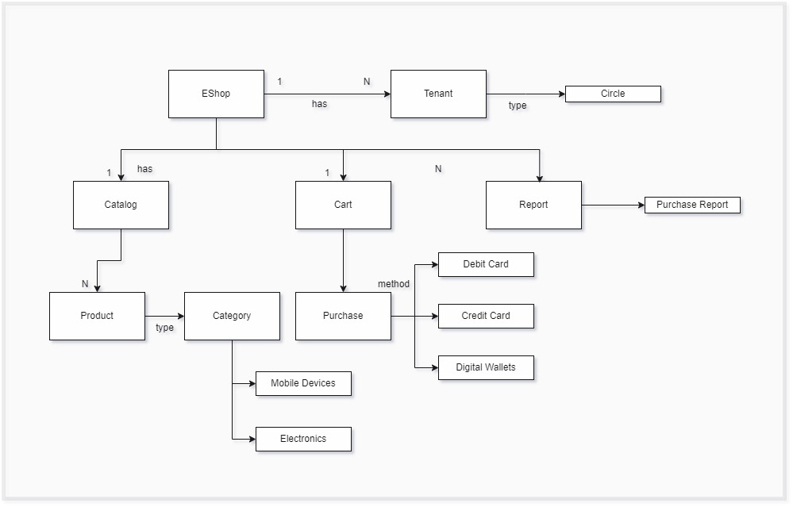
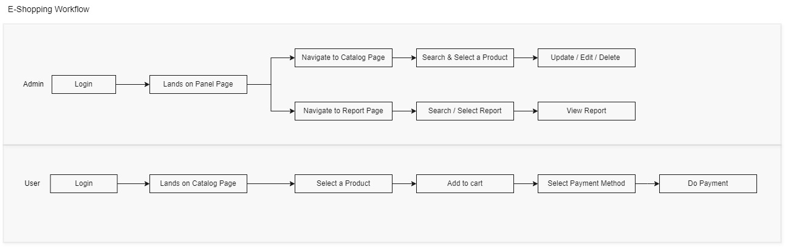
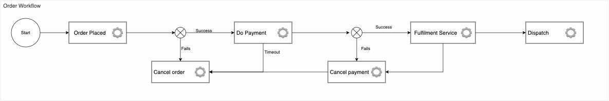
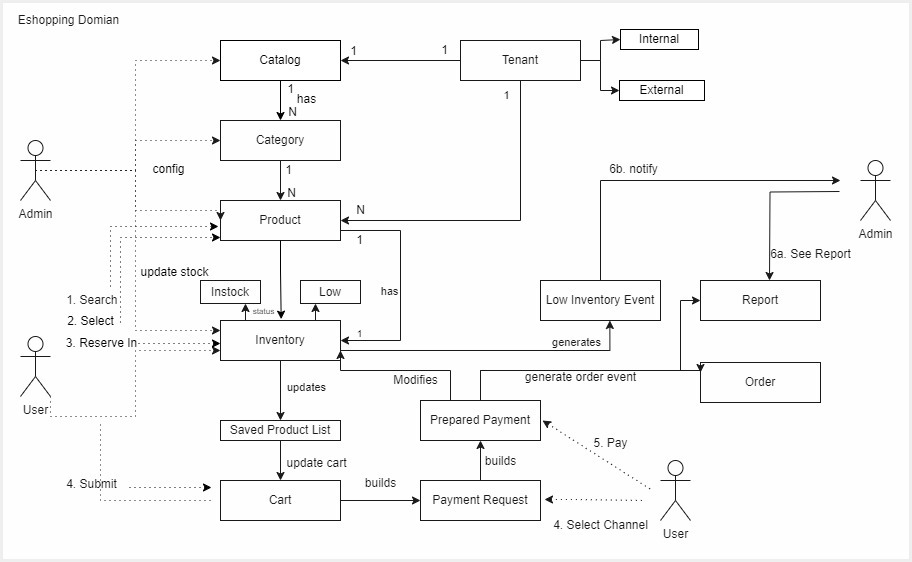
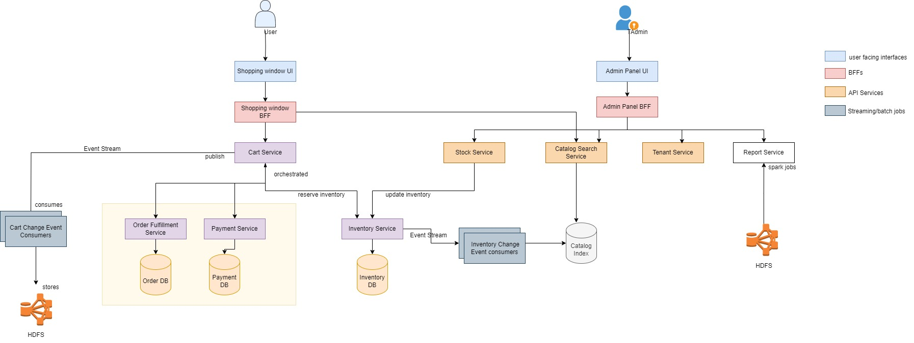
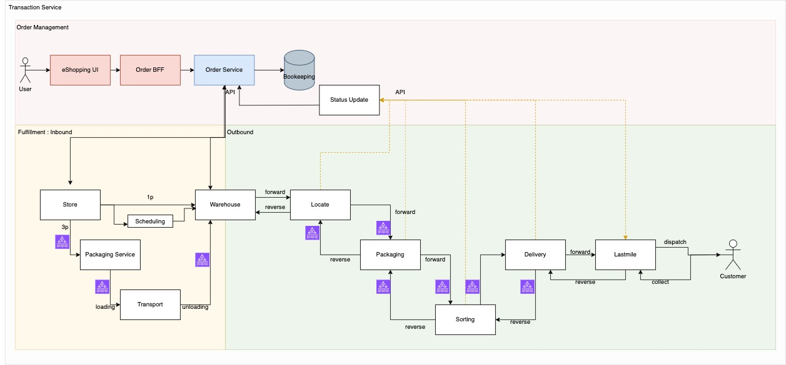
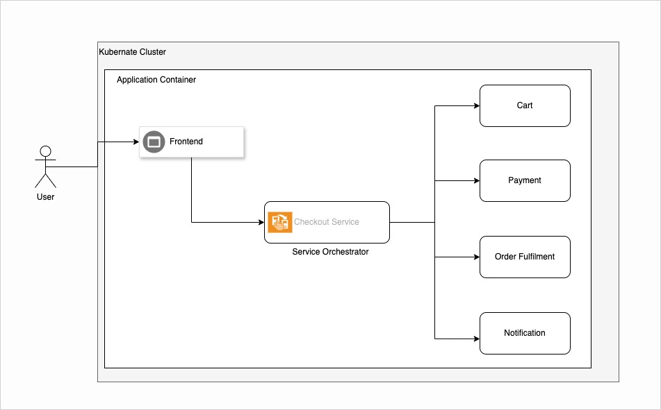
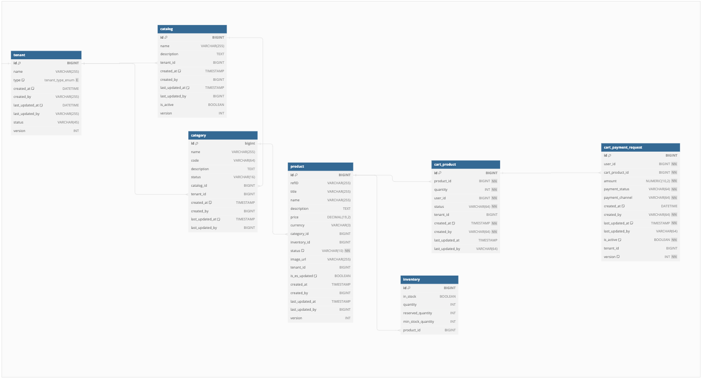
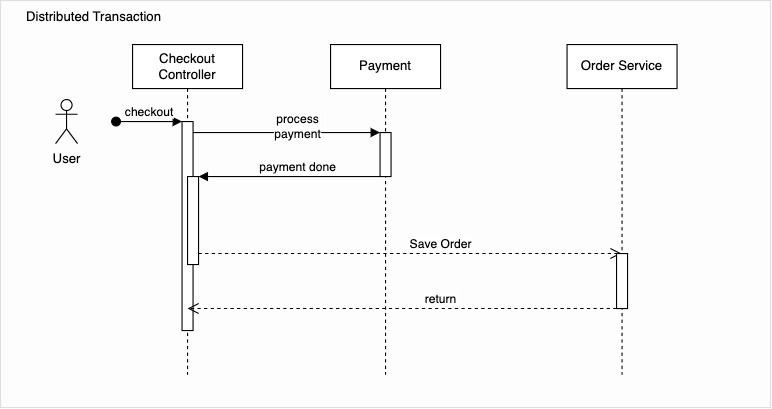
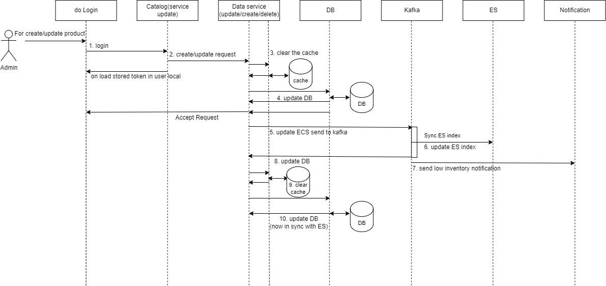

# E-Shopping Platform

## Introduction
This repository contains the source code and documentation for the E-Shopping Platform, a multi-tenant SaaS solution designed to facilitate online shopping and management for various products.

## Features
- Product catalog with extensive search capabilities.
- Shopping cart functionality.
- Multiple payment methods support.
- Admin interface for product and order management.
- Event-sourcing based architecture for robust operation.

## Domain Definitions
The platform is structured around several key domain concepts:
- **Catalog**: Information about products and services.
- **Product**: Items listed under the catalog for sale.
- **Category**: A product category defines the classification of a product based on its name, description, Strategic Business Unit (SBU), Category Group like Mobile Devices etc and the type of item it represents.
- **Cart**: Where users add products to purchase.
- **Checkout**: Where users submit the cart and create order.
- **Order**: Where users do the payment and on success create product dispatch request.

## Workflow
The workflow for both users and admins are as follows:

### User Workflow
1. User Login and Navigation.
2. Search and select products.
3. Add products to the cart.
4. Proceed for checkout and prepare Payment.
5. Place the order.
6. Payment.

### User Login and Navigation workflow

### Order Service Workflow

 
### Admin Workflow
1. Manage catalog and products.
2. View and handle orders.
3. Generate reports.

## Domain Diagram

## Architecture
The system employs a microservices architecture to ensure scalability and reliability. Below is the component diagram illustrating the primary services and their interactions.

## Component Diagram

### Inventory Service

### Order Fullfillment

## Checkout Orchestration Service

## Low-Level Design
Please refer to the low-level design document for detailed API endpoints, database schema, and sequence diagrams that describe the interactions between various components.
### DB Schema

### Transaction Service

### Inventory Update Service

### Design Pattern 
1. **Domain Driven Design** : Business-Oriented Design focuses on understanding and addressing the strategic requirements.
2. **Event Based Communication** : For independenct and loosly coupled application.
3. **Failure Isolation** : Containarise the error and localise error cascading.
4. **Flow Control** : Using Timeout, Circuit Breaker and forward retry.

### Quality
1. **Code** : CheckStyle, FindBug, SonarQuebe.
2. **Code Coverage** : JaCoCo
3. **Integration test** : Cocumber
4. **Security** : OWASP ZAP, Fortify, Snyk
5. **Performance** : JMeter
6. **Automated DB migration** : DB Serenity
7. **Release** : Canary
8. **Monitoring** : Splunk, Datalog, Prometheous, MMS, Graffana
9. **Failover** : Feature toggling, BackUp, DR, Multi-Region Deployment, AutoScaling.
10. **Dashboard** : Dora, Graffana, Kitt Metrics API
11. **Alert** : DataDog, PagerDuty, ServiceNow.
12. **APM** : NewRelic
13. **Schema Copy** : SchemaCrawler, ERBuilder
14. **Deployment** : Kubernate, HPA, AutoScaler
15. **Development** : Feature Branching, IntelliJ IDE 

## Installation
Provide step-by-step series of examples and explanations about how to get a development environment running. Mention prerequisites, environment setup, and deployment steps.

# Clone the repository
git clone https://github.com/manishjha201/awesome-solutions.git 

# Navigate to the repository directory
cd eshopping-platform

